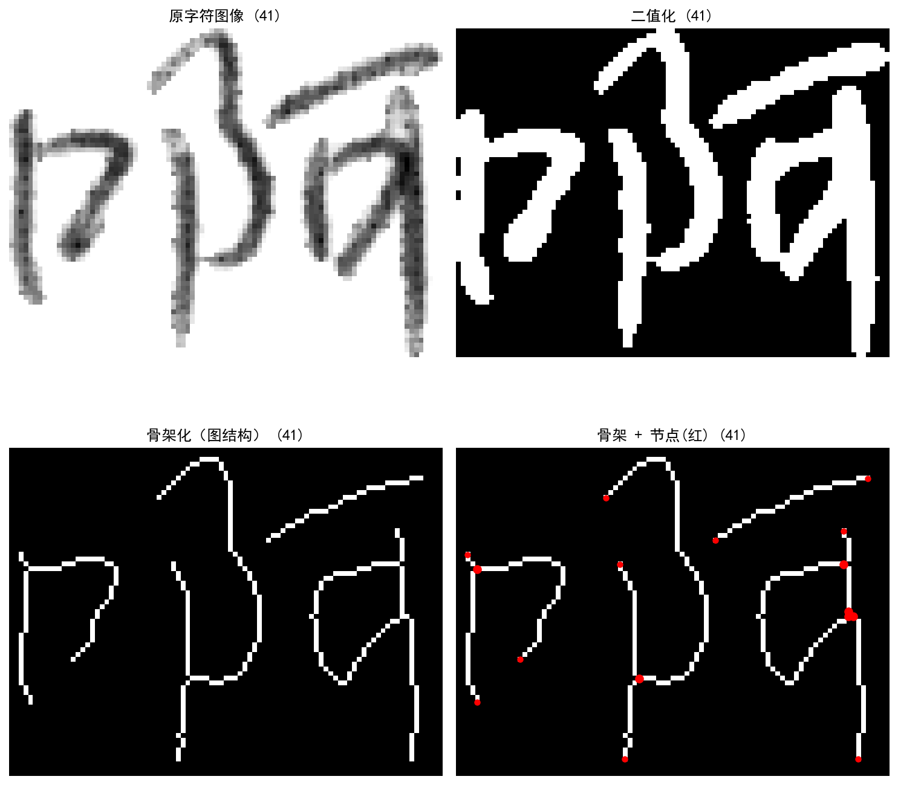
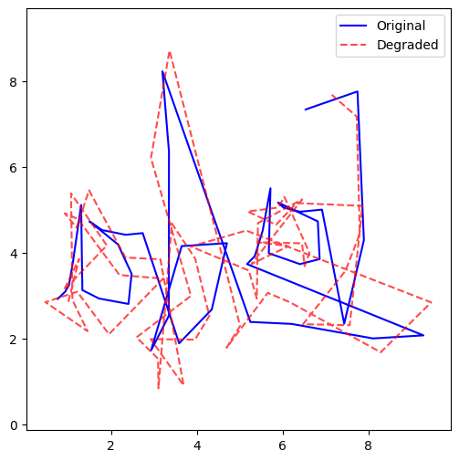

# 结构约束自监督汉字书写质量模型

[](https://github.com/tianyi-sh/hanzi/actions/workflows/ci.yml)

本仓库实现“离线 GNT 字形 + 在线书写轨迹”的结构约束自监督实验流程。主流程从配对数据构建字形结构图和轨迹特征，依次训练重建、结构对齐、一致性与质量排序目标，并保存指标、检查点和可解释图像。

## 我完成的工作

这个项目围绕“没有大规模人工质量标签时，怎样利用汉字自身结构评价在线书写轨迹”展开。我完成了从数据读取、结构建模到训练评估的完整实验链路：

| 工作 | 具体实现 | 代码入口 |
| --- | --- | --- |
| 打通两种书写数据 | 解析离线 GNT 字形与在线 `(t, x, y, f)` 轨迹，并构建可复现的配对 manifest | [`src/datasets/`](src/datasets/)、[`scripts/prepare_data.py`](scripts/prepare_data.py) |
| 构建汉字结构表示 | 对二值字形进行骨架化，提取端点、分叉点和结构边，将像素字形转为可学习的图表示 | [`struct_builder.py`](src/datasets/struct_builder.py)、[`graph_ops.py`](src/utils/graph_ops.py) |
| 设计结构约束学习目标 | 将几何软覆盖先验、语义对齐分布和结构一致性组合进训练目标 | [`align_utils.py`](src/datasets/align_utils.py)、[`src/losses/`](src/losses/) |
| 实现无标签质量排序 | 自动构造轨迹退化样本，以原始/退化样本对训练质量得分头，不依赖人工质量分数 | [`train_stage3.py`](src/trainers/train_stage3.py)、[`ranking.py`](src/losses/ranking.py) |
| 建立完整实验闭环 | 实现三阶段训练、检查点、日志、指标评估、结果图和一键入口 | [`run_pipeline.py`](run_pipeline.py)、[`src/eval/`](src/eval/) |
| 完成工程化与验证 | 配置化数据路径、固定抽样种子、隔离大文件，并用合成数据验证三阶段 CPU 流程 | [`tests/`](tests/)、[CI](.github/workflows/ci.yml) |

更详细的“贡献—实现—证据”对应关系见 [项目贡献与创新说明](docs/PROJECT_CONTRIBUTIONS.md)。

## 核心创新点

1. **把字形外观转换为结构约束。** 项目不只比较图像像素，而是从离线字形骨架中提取端点、分叉点和结构边，使在线书写轨迹能够与汉字结构单元建立联系。
2. **联合几何先验与可学习语义对齐。** 先根据轨迹到各结构边的距离构造软覆盖先验 `π(k)`，再学习轨迹时刻到结构边的对齐分布 `a(t,k)`，使用 KL 损失和结构一致性损失共同约束表示。
3. **用自监督退化对学习质量顺序。** 在没有人工质量评分的条件下，对原始轨迹加入可控扰动生成退化样本，通过 margin ranking loss 学习“原始样本得分高于退化样本”的相对质量关系。
4. **用多目标阶段化实验连接表示学习与质量评价。** 三个阶段依次加入重建、结构一致性和质量排序目标，让每一类约束都能单独记录与评估，而不是只输出一个不可解释的总分。

这些创新点描述的是仓库当前已经实现的方法机制，不等同于已经完成公开数据集上的领先性比较或论文基准复现。

## 项目展示

| 字形结构提取 | 原始轨迹与自动退化轨迹 |
| --- | --- |
|  |  |

左图展示从 GNT 字形到二值图、骨架和结构节点的处理过程；右图展示质量排序阶段使用的原始/退化轨迹对。更多图像位于 [`assets/figures/`](assets/figures/)，其中历史实验图仅作过程展示，不作为公开基准结论。

## 当前能力与边界

| 状态 | 内容 |
| --- | --- |
| 已提供 | GNT 首记录解析、在线轨迹预处理、结构图构建、三阶段 CPU 训练、重建/对齐/排序评估、结果可视化 |
| 需要外部准备 | 配对的 GNT 与在线轨迹 CSV；完整数据不随仓库发布 |
| 未提供 | 预训练权重、公开可下载数据集、GPU/CUDA 设备选择、完整 GNT 文件逐记录展开、可直接复现的论文基准表 |

## 方法流程

```text
GNT 首记录 ──> 二值字形 ──> 骨架与结构边 ─┐
                                           ├─> 结构对齐与三阶段训练 ─> 指标/检查点/图像
在线 CSV ──> [x, y, f, speed, dt] ────────┘
```

训练目标：

- Stage 1：`L_mae + λ1 L_align`
- Stage 2：`L_mae + λ1 L_align + λ2 L_cons`
- Stage 3：`L_mae + λ1 L_align + λ2 L_cons + λ3 L_rank`

## 仓库结构

```text
.
├── configs/                 # 结构参数与三阶段训练配置
├── src/
│   ├── datasets/            # GNT/轨迹读取、结构图和 processed 数据
│   ├── models/              # 轨迹、结构、对齐、解码与质量头
│   ├── losses/              # 重建、对齐、一致性和排序损失
│   ├── trainers/            # 三阶段训练
│   ├── eval/                # 重建、对齐、排序评估与绘图函数
│   └── utils/
├── scripts/                 # 数据准备、扩增、评分与可视化入口
├── tests/                   # 读取器、数据准备和 CPU 冒烟测试
├── assets/figures/          # 参考图与已生成示例
├── outputs/reference/       # 一次历史运行的轻量日志和指标
├── DATASETS.md              # 数据契约与版本控制边界
├── docs/                    # 项目贡献说明与本地材料目录
├── ORGANIZATION.md          # 仓库整理来源
└── run_pipeline.py          # 主流程入口
```

原始数据、processed 张量、训练检查点、运行目录及大型 Office/PDF 材料均由 `.gitignore` 排除。

## 环境要求

- Python 3.11（GitHub Actions 已验证）
- 当前训练入口使用 CPU；其他 Python/PyTorch 组合与 GPU 路径未声明为已验证

### Windows PowerShell

从干净克隆开始：

```powershell
git clone https://github.com/tianyi-sh/hanzi.git
cd hanzi
python -m venv .venv
.\.venv\Scripts\Activate.ps1
python -m pip install --upgrade pip
python -m pip install -r requirements.txt
python -m pip check
```

### Linux/macOS

```bash
git clone https://github.com/tianyi-sh/hanzi.git
cd hanzi
python3 -m venv .venv
source .venv/bin/activate
python -m pip install --upgrade pip
python -m pip install -r requirements.txt
python -m pip check
```

## 数据准备

外部数据目录至少需要 10 对以下文件：

```text
<数据目录>/
├── 1.gnt
├── 1_online.csv
├── 2.gnt
├── 2_online.csv
└── ...
```

在线 CSV 必须包含 `timestamp`（或 `t`）、`x`、`y`、`f` 列。完整说明见 [DATASETS.md](DATASETS.md)。

从仓库根目录执行，并把占位符替换为实际路径：

```powershell
python scripts\prepare_data.py --source-dir "<数据目录>" --sample-count 10 --seed 42
```

该命令生成：

- `data/raw/gnt/`
- `data/raw/online/`
- `data/raw/pairs.csv`（使用相对路径）

也可以设置环境变量后省略参数：

```powershell
$env:HANZI_DATA_DIR = "<数据目录>"
python scripts\prepare_data.py
```

## 训练

准备数据后运行：

```powershell
python run_pipeline.py
```

在干净克隆中也可让主入口自动准备数据：

```powershell
python run_pipeline.py --source-dir "<数据目录>" --sample-count 10 --seed 42
```

训练配置位于 `configs/`。每次运行在 `outputs/runs/run_YYYYMMDD_HHMMSS/` 保存配置副本、各阶段检查点、`metrics.json` 和 `logs.jsonl`。

## 评估与可视化

将 `<run>` 替换为实际运行目录：

```powershell
python src\eval\eval_reconstruction.py --checkpoint "outputs/runs/<run>/stage1/checkpoints/best.pt"
python src\eval\eval_alignment.py --checkpoint "outputs/runs/<run>/stage1/checkpoints/best.pt"
python src\eval\eval_ranking.py --checkpoint "outputs/runs/<run>/stage3/checkpoints/best.pt"
python scripts\run_visualize.py --sample-id sample_00 --output-dir outputs\figures
```

`outputs/figures/` 是可重新生成的本地目录；已选取的示例位于 [`assets/figures/generated_examples/`](assets/figures/generated_examples/)。历史日志仅作为格式与流程参考，见 [`outputs/reference/stage3/`](outputs/reference/stage3/)，不代表公开基准结果。

## 验证

从仓库根目录执行：

```powershell
python -m compileall -q run_pipeline.py scripts src tests
python -m unittest discover -s tests -v
```

测试覆盖读取器契约、确定性数据抽样，以及使用合成数据完成 Stage 1–3 构建、训练、检查点保存和评估的 CPU 冒烟流程。相同检查由 GitHub Actions 执行。

## 进一步文档

- [数据说明](DATASETS.md)
- [项目贡献与创新说明](docs/PROJECT_CONTRIBUTIONS.md)
- [整理记录](ORGANIZATION.md)
- [贡献指南](CONTRIBUTING.md)
- [本地项目材料目录](docs/README.md)
- [引用元数据](CITATION.cff)

## 许可证状态

本仓库目前没有声明开源许可证。作者选择许可证前，仓库内容的使用与再分发权限未作开源授权。
